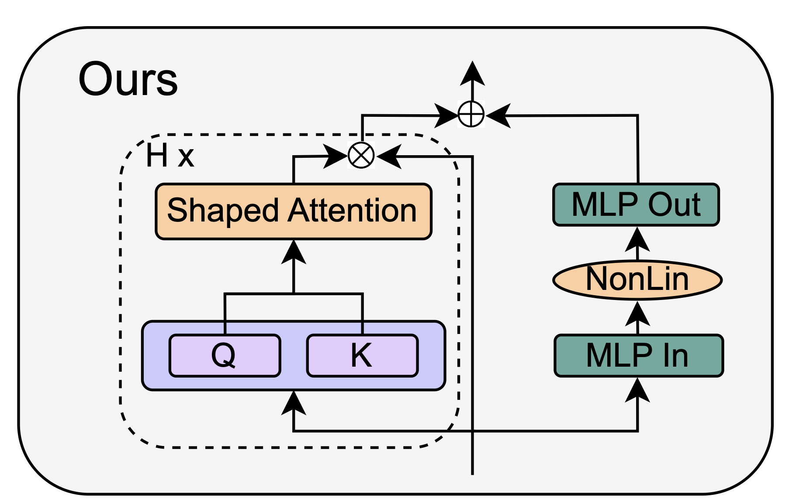

# Mech. interp. (MI)

- Reverse-engineering neural network circuits.
- @nanda2023 shows MI modular addition transformer.
- There are (allegedly) low hanging fruits in MI.

# Grokking

- Grokking is when a model suddenly generalises.
- @nanda2023 shows grokking in a transformer.
- Grokking means the weights represents an algorithm...
- ... rather than a dataset.

\framebreak

- Since MI is about reverse-engineering circuits...
- ... grokking is a good sign for MI ...
- ... as it means circuits are _there_.

# $\mathbb{Z}$-sequences

- @belcak2022 shows that transformers can sequences $\in\mathbb{Z}$.
- They work in thousands of squences from OEIS [@sloane2003].
- They have four tasks: (1) sequence classification, (2) sequence comparission, (3) sequence continuation, and (4) sequence unmasking.
- Each task is strictly harder than the previous one.

\framebreak

- Though $\mathbb{Z}$-sequences are simple to see, some can be hard to impossible to understand.
- $1, 2, 3, ..., 100$ is easy, while the busy beaver sequence [@aaronson2020] is hard/impossible.
- Complexity ranges from trivial to fuck-off-forever.

# MIII

- MI on primes.
- Base 10 centric.
- Last digits $d_l \in \{1,3,7,9\}$
- @conmy2023 tries to automate this.

\framebreak

| $x_0$ | $x_1$ | $x_2$ | $x_3$ | $y_0$ | $y_1$ | $y_2$ | $y_3$ |
|:------|:------|:------|:------|------:|------:|------:|------:|
|  1001 |  1003 |  1007 |  1009 |     0 |     0 |     0 |     1 |
|  1011 |  1013 |  1017 |  1019 |     0 |     1 |     0 |     1 |
| $\vdots$ ||||||| $\vdots$ |
|  9981 |  9983 |  9987 |  9989 |     0 |     0 |     0 |     0 |
|  9991 |  9993 |  9997 |  9999 |     0 |     0 |     0 |     0 |

Table: Four digit dataset with numbers and labels ($[ \textbf{X} | \textbf{Y} ]$).

\framebreak

- I will focus on @he2023's simple transformer (see [@sec:simpletrans]).

# Simple trans. [@he2023] {#sec:simpletrans}

::: {.columns align=center }
:::: column

- Simple attention [@eq:attn]

::::
:::: column
$$\textbf{A}(\textbf{X}) \leftarrow (\alpha I_T + \beta \textbf{A}(\textbf{X}))$$ {#eq:attn}
::::
:::

\framebreak

